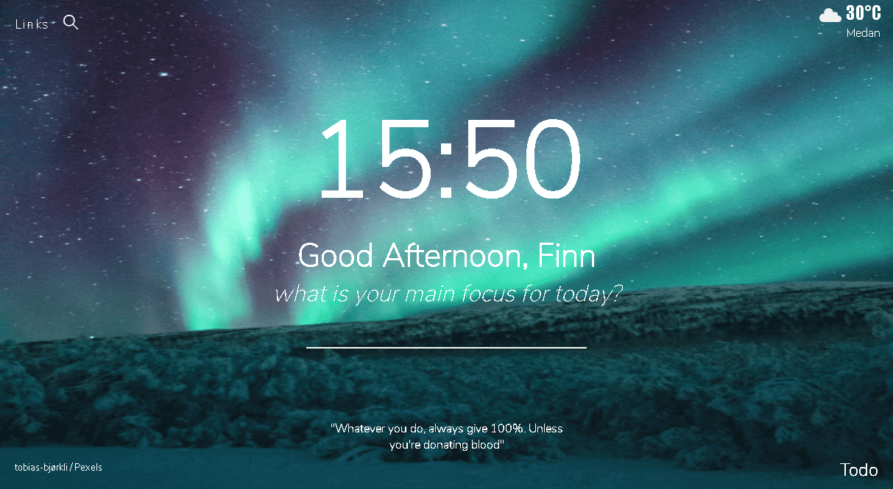
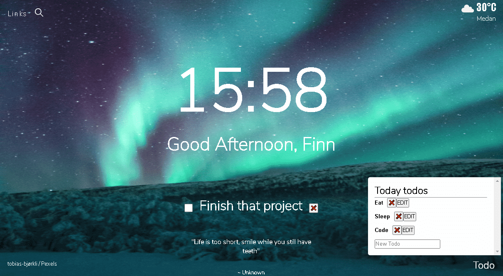
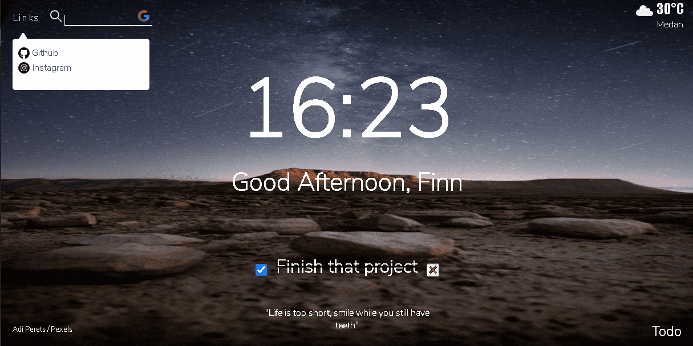

<h1> Momentum Clone </h1>

 
 This is just one of my personal project, a fully functional momentum clone, just with HTML, CSS, and Vanilla Javascript. 

 
 A little bit story, Momentum is a chrome browser extension with more than 3 million users. So you can imagine how popular it is right ? 

 <h2> Clone functionallity </h2>

 <ul>
  <h3> Time and Name </h3>
   
 Location : Mid. 

   <li>Asking username when first come to website.</li>
   <li>Set and load username to Local storage, so user don't have to type the name whenever comeback to the website. </li>
   <li>Greeting the user with morning / afternoon / night on specific time.</li>
   <li>Digital Clock (hour and minute) 

  <h3> Mid mini Todo or MainFocus </h3>
   
 Location : Mid. 

   <li>Asking user's MainFocus and save it to local storage. </li>
   <li> if user checked the mainfocus, it'll add line through, it can be toggled.</li>
   <li>if user delete the mainfocus, it'll delete mainfocus on screen, as well on local storage. </li>

  <h3> Background and quotes </h3>
   
 Location : Mid bottom , Right Bottom. 

   <li>Changing awesome background in every refresh. </li>
   <li> Showing photographer name and link to photo in bottom left screen. </li>
   <li>Changing funny and motivational quotes in every refresh. </li>
   <li> if user hover the quotes, name's who said the quote is scaling smoothly to screen. </li>

  <h3>Links and Search</h3>
   
 Location : Left Top. 

   <li> if user click the links, it'll show some container for link (in this case it just my instagram and my github profile. </li>
   <li> as expected, if you click the link, it'll bring the user to my instagram / github profile. </li>
   <li> If user click the magnifier or hover right next to magnifier, it'll show input and little google icon. </li>
   <li> When user typing and hit enter, it'll open google search in new tab with whatever value user type. </li>

  <h3>Weather and location </h3>
   
 Location : Right Top. 

   <li> Asking user location, if it's blocked or ignored. Weather and location will not showing. </li>
   <li> If allowed, it'll show user location (city), temperature (celcius) , and little icon that describing the weather. </li>

  <h3>Real Todo List </h3>
   
 Location : Right Bottom. 

   <li> Showing and hiding user todo list container whenever clicked. </li>
   <li> Whenever user type something and hit enter, todos will add to container. </li>
   <li> todos can be edited, or deleted with self explanatory icon / text right next to todos. </li>
   <li> todos is saved to Local Storage (same when adding, editing and deleting) so it's not empty when user refresh the page .</li>
 </ul>

 <h2> Image preview</h2>

  <h3> First view </h3>

   

  <h3> On Functionality </h3>

   

  <h3> On Functionality 2 </h3>

   

   
 i think the image itself is self explanatory 

 <h2> Video preview </h2>
   
 You can visit <a href="https://www.instagram.com/finn_ahamed/" target="_blank"> my instagram </a>, or in  <a href="https://www.instagram.com/p/CMWzhi4nLMu/" target="_blank"> this post </a> , where i did the less 1 minute demo for this project.

 <h2> Live Website Preview </h2>

   
 <a href="https://finn-momentum.netlify.app/" target="blank">Here </a> or <a href="https://finn-momentum.netlify.app" target="_blank">https://finn-momentum.netlify.app </a> in case you don't believe me lol xD.

 <h2>Available for you? </h2>

   
 yes, just clone, grab the code, and do whatever you want with the code. Maybe adding more features to make it your own. <strong> BUT, i recommend you to use your API Key </strong> to fetch the data from Weather API. In case you wondering, just sign up for <a href="https://openweathermap.org/api" target="blank">https://openweathermap.org/api </a> , and voila... you got an API Key. 

